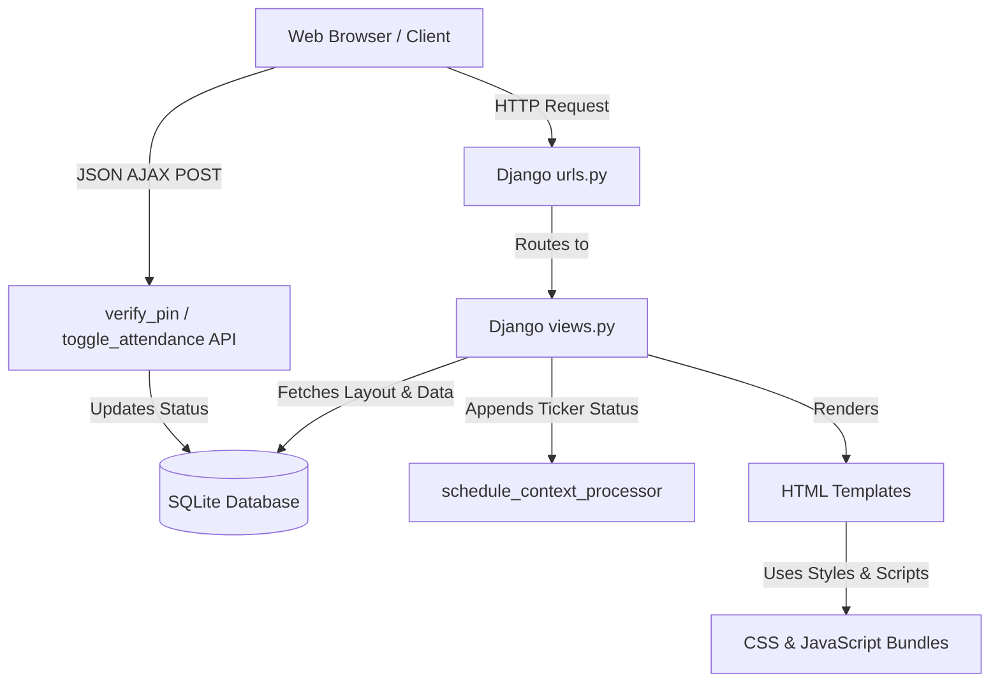

# 🏫 FocusFlow Kindergarten Attendance Application

Welcome to the **FocusFlow Kindergarten Attendance Application**! This project is a kid-friendly, playful, and responsive web application designed for classroom check-ins, mood tracking, and teacher-led classroom management. It features a bubbly custom UI, real-time confetti rewards, an automated announcement ticker bar synchronized with school hours, and an AI-powered visual layout builder.

---

## 📐 Application Architecture

The application is built on top of **Django** and styled using vanilla CSS with custom kid-themed components. Below is a high-level system layout showing how components interact:



---

## 📁 Step-by-Step File Descriptions

Here is a comprehensive breakdown of each directory and file in the codebase, explaining their purpose and functional flow.

### 1. Main Project Settings
* **[`kindergarten_attendance/settings.py`](file:///Users/hariprasathm/VirtualBox%20VMs/KindergartenApp/kindergarten_attendance/settings.py)**
  * Contains the core configuration settings for the Django framework.
  * Registers installed apps (including `attendance`).
  * Injects `attendance.views.schedule_context_processor` in `TEMPLATES` to ensure the school ticker bar (`schedule_status`) is available on all pages automatically.
  * Configures session parameters (`SESSION_EXPIRE_AT_BROWSER_CLOSE = True`) to enforce authentication safety.
* **[`kindergarten_attendance/urls.py`](file:///Users/hariprasathm/VirtualBox%20VMs/KindergartenApp/kindergarten_attendance/urls.py)**
  * The root URL configuration file. Routes requests starting with `teacher/` or student check-ins to `attendance.urls`.

### 2. Attendance App Models & Schema
* **[`attendance/models.py`](file:///Users/hariprasathm/VirtualBox%20VMs/KindergartenApp/attendance/models.py)**
  * Defines the database schema:
    * `ClassroomOption`: Stores active classrooms (e.g. Bumblebees, Butterflies) along with emojis and sorting orders.
    * `Student`: Stores active student names, classrooms, animal badges, colors, and 4-digit PINs.
    * `Attendance`: Records student check-ins. Implements `get_current_time_period()` to classify check-ins into Morning, Afternoon, or Evening.
    * `AppLayoutBlock`: Contains component orders and visibility flags for visual page customizer settings.

### 3. Application Logic & Routing
* **[`attendance/urls.py`](file:///Users/hariprasathm/VirtualBox%20VMs/KindergartenApp/attendance/urls.py)**
  * Maps URL paths to specific python functions in `views.py`.
* **[`attendance/views.py`](file:///Users/hariprasathm/VirtualBox%20VMs/KindergartenApp/attendance/views.py)**
  * Handles the application logic:
    * `home`: Renders the portal landing dashboard.
    * `student_grid`: Collects students for the selected classroom and renders them based on `AppLayoutBlock` configurations.
    * `toggle_attendance`: Handles checking student in or deleting records (toggle off) via JSON POST request. Also automatically tags late check-ins if processed after 9:30 AM.
    * `teacher_dashboard`: Gathers classroom aggregates, metrics, and presents grid/table views.
    * `ai_chat_command` & `save_layout`: Backs the developer customizer page builder, parsing natural language commands offline or via Gemini API.
* **[`attendance/tests.py`](file:///Users/hariprasathm/VirtualBox%20VMs/KindergartenApp/attendance/tests.py)**
  * The automated testing script containing 17 unit tests verifying models validation, authentication middleware, APIs, and AI fallback matching.

### 4. HTML Templates
* **[`attendance/templates/attendance/base.html`](file:///Users/hariprasathm/VirtualBox%20VMs/KindergartenApp/attendance/templates/attendance/base.html)**
  * The main structural container. Hosts the **fixed scrolling marquee announcement ticker** and the **playful unified navigation header**.
* **[`attendance/templates/attendance/home.html`](file:///Users/hariprasathm/VirtualBox%20VMs/KindergartenApp/attendance/templates/attendance/home.html)**
  * Dashboard landing page offering choice navigation cards to redirect users to "Kids Area" or "Teacher Portal".
* **[`attendance/templates/attendance/student_grid.html`](file:///Users/hariprasathm/VirtualBox%20VMs/KindergartenApp/attendance/templates/attendance/student_grid.html)**
  * Kids check-in grid displaying active animal cards, and keypad and mood overlays.
* **[`attendance/templates/attendance/teacher_dashboard.html`](file:///Users/hariprasathm/VirtualBox%20VMs/KindergartenApp/attendance/templates/attendance/teacher_dashboard.html)**
  * Admin dashboard with real-time stats, grid/list view switcher, and quick-action check-ins.
* **[`attendance/templates/attendance/login.html`](file:///Users/hariprasathm/VirtualBox%20VMs/KindergartenApp/attendance/templates/attendance/login.html)**
  * Authentication card featuring tab slides for Student pin selection and Teacher login.
* **[`attendance/templates/attendance/developer_page.html`](file:///Users/hariprasathm/VirtualBox%20VMs/KindergartenApp/attendance/templates/attendance/developer_page.html)**
  * The visual page builder and Gemini chatbot customization console.

### 5. Static Assets
* **[`static/css/kid_theme.css`](file:///Users/hariprasathm/VirtualBox%20VMs/KindergartenApp/static/css/kid_theme.css)**
  * Contains the styling guidelines. Implements floating cloud keyframes, bouncy hover cards, and scrolling text marquees.
* **[`static/js/kid_attendance.js`](file:///Users/hariprasathm/VirtualBox%20VMs/KindergartenApp/static/js/kid_attendance.js)**
  * Implements dynamic frontend components, HTML5 drag-and-drop lists, and Starburst particles physics canvas for checking in.

---

## 🛠️ How to Update and Make Code Changes

Here is a step-by-step guide on how to update common features within the application.

### A. Adjusting School Hours & Breaks
1. Open [`attendance/views.py`](file:///Users/hariprasathm/VirtualBox%20VMs/KindergartenApp/attendance/views.py).
2. Locate the function `get_school_schedule_status()`.
3. Update the `datetime.time` arguments. For example, to change school start time to `9:00 AM`:
   ```python
   start_time = datetime.time(9, 0)
   ```
4. Update the text strings and `milestones` dictionary in that same function to align the ticker labels.

### B. Adding a New Component Block to the Student Grid
1. Open [`attendance/views.py`](file:///Users/hariprasathm/VirtualBox%20VMs/KindergartenApp/attendance/views.py).
2. Locate the `get_or_seed_layout_blocks()` function.
3. Append a new block specification tuple to `default_blocks`, for example:
   ```python
   ('announcement_board', 'Classroom Announcement Board', 5)
   ```
4. Open [`attendance/templates/attendance/student_grid.html`](file:///Users/hariprasathm/VirtualBox%20VMs/KindergartenApp/attendance/templates/attendance/student_grid.html).
5. Add a corresponding template logic block:
   ```html
   
   <!-- Custom markup for your board here -->
   
   ```

### C. Modifying Custom Colors or Fonts
1. Open [`static/css/kid_theme.css`](file:///Users/hariprasathm/VirtualBox%20VMs/KindergartenApp/static/css/kid_theme.css).
2. Go to the `:root` selector at the top of the file to modify variables (e.g. `--kids-blue`, `--kids-pink`, or `--sky-blue`).
3. To alter typography, replace the Google Fonts link in [`base.html`](file:///Users/hariprasathm/VirtualBox%20VMs/KindergartenApp/attendance/templates/attendance/base.html) and update `font-family` references in the CSS file.

---

## ⚙️ Running Seeding and Tests

To restore the application to its default seeded state and run tests, use the following terminal commands:

1. **Seed default data (creates 12 students, active classrooms, and the admin user):**
   ```bash
   venv/bin/python seed_data.py
   ```
2. **Execute tests:**
   ```bash
   venv/bin/python manage.py test
   ```

---

## 🚀 Docker Deployment on AWS EC2 (Step-by-Step)

Follow these instructions to deploy this application in a Docker container on a fresh AWS EC2 instance:

### Step 1: Launch your EC2 Instance
1. Log in to your **AWS Console** and navigate to the **EC2 Dashboard**.
2. Click **Launch Instance**.
3. Select **Ubuntu Server 22.04 LTS** (or 24.04 LTS) as the Machine Image (AMI).
4. Choose an instance type (e.g. `t2.micro` or `t3.micro` which are Free Tier eligible).
5. Generate or choose an SSH Key Pair (`.pem`) for connection.
6. Under **Security Groups / Network Settings**:
   * Allow **SSH (port 22)** from your IP address.
   * Allow **HTTP (port 80)** from anywhere (`0.0.0.0/0`).
7. Click **Launch Instance**.

### Step 2: Connect to your EC2 Instance
Open your local terminal and connect via SSH using your key pair:
```bash
ssh -i /path/to/your-key.pem ubuntu@<your-ec2-public-ip>
```

### Step 3: Install Docker & Docker Compose
Run the following commands on your EC2 terminal:
```bash
# Update Ubuntu package index
sudo apt-get update && sudo apt-get upgrade -y

# Install Docker
sudo apt-get install -y docker.io

# Start and enable Docker service
sudo systemctl start docker
sudo systemctl enable docker

# Allow running docker command without sudo (optional)
sudo usermod -aG docker ubuntu

# Install Docker Compose
sudo apt-get install -y docker-compose
```
*Note: Disconnect from SSH and log back in to apply the group membership updates.*

### Step 4: Clone Repository & Deploy Application
1. Clone the repository to the EC2 server:
   ```bash
   git clone https://github.com/leoxurDev/AttendenceApplication.git
   cd AttendenceApplication
   ```
2. Initialize and seed mock data in the SQLite database file:
   ```bash
   docker-compose run --rm web python seed_data.py
   ```
3. Run the container in the background (daemon mode):
   ```bash
   docker-compose up --build -d
   ```

### Step 5: Access the Web Application
Open your web browser and enter the public IP of your EC2 instance:
```
http://<your-ec2-public-ip>/
```
Your FocusFlow Kindergarten app is now live and containerized!

---

## 📸 Architecture Diagram & UI Layout Reference

The following image represents the visual layout hierarchy and block structure of our student check-in portal:


